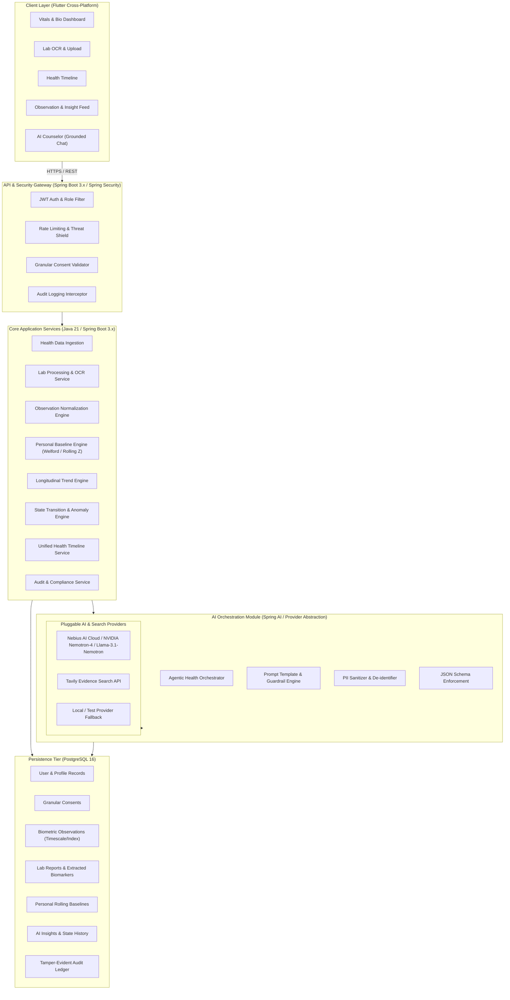
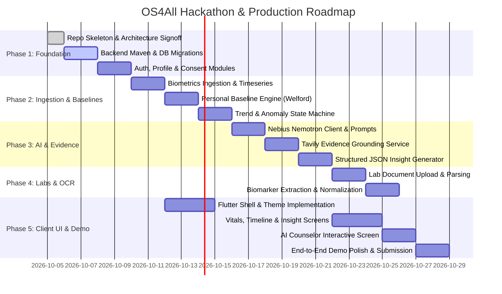
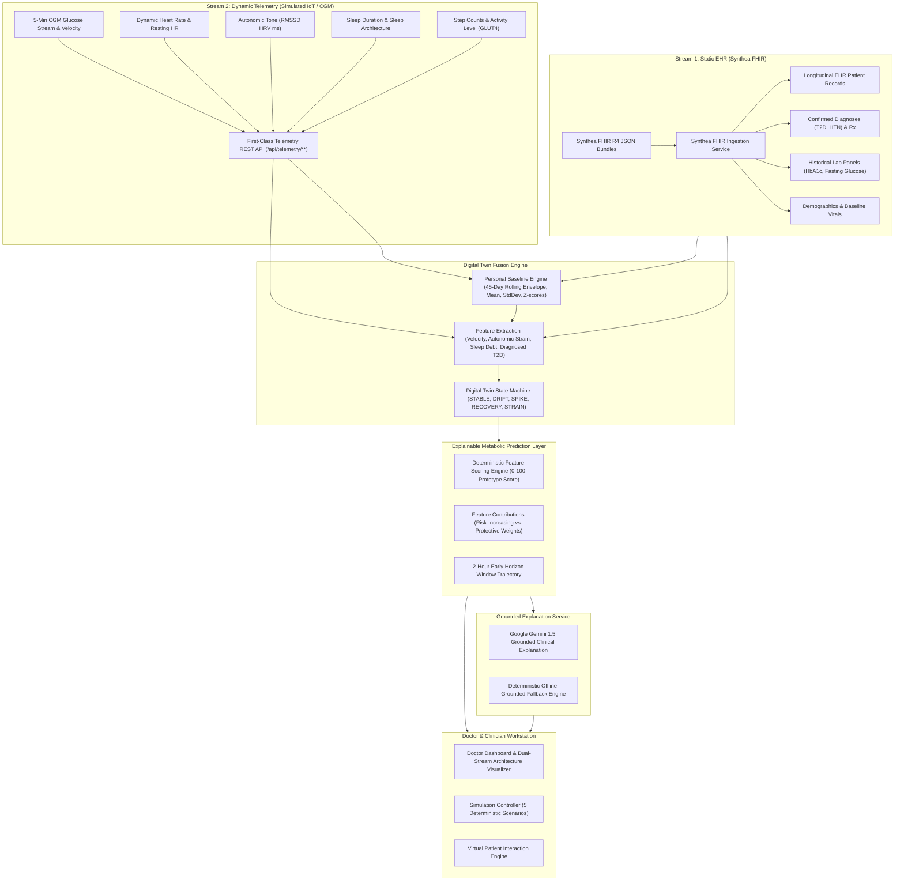

# OS4All — Preventive Health Intelligence Operating System
## Master Architecture Specification & System Blueprint

**Document Version:** 1.0.0  
**Target:** Nebius × NVIDIA Global AI Hackathon & Production Foundation  
**Classification:** Architectural Blueprint & Engineering Specification  

---

## 1. Executive Summary & Mission

### 1.1 Mission Statement
> *"Build a preventive health intelligence operating system that continuously understands a person's health data, establishes their personal baseline, detects meaningful changes over time, explains those changes with AI, retrieves supporting evidence when needed, and recommends appropriate next steps without claiming to diagnose disease."*

### 1.2 Core Architectural Principles & Guardrails
1. **Not a Generic Chatbot:** Conversational interaction is only one interface layer (the AI Counselor) into an underlying deterministic intelligence pipeline.
2. **Not a Passive Dashboard:** The system proactively evaluates incoming metrics against longitudinal baselines, triggers state transitions, and generates explainable insights.
3. **No Medical Diagnosis Claims:** The system outputs informational health states (`STABLE`, `DRIFT`, `ANOMALY`, `FOLLOW_UP`). It never asserts "You have disease X"; it reports "Your resting heart rate has elevated 14% above your 30-day baseline over 5 consecutive days, which correlates with reduced deep sleep."
4. **Observation vs. Interpretation Separation:** Every AI artifact distinctly demarcates:
   - **Observation:** Deterministic, measurable data facts (e.g., HbA1c is 5.9%, elevated from 5.4%).
   - **Interpretation:** Contextual, probabilistic AI reasoning referencing physiological mechanisms and external literature.
   - **Recommended Action:** Non-prescriptive next steps (e.g., "Schedule routine primary care lab review", "Monitor fasting glucose for 7 days").
5. **No Medical Data Fabrication:** Strictly grounded inputs; zero synthetic hallucinations; fallback to evidence retrieval (Tavily + PubMed/NIH) with exact citations.
6. **Privacy, Consent & Auditability by Design:** Granular consent contracts, PII stripping before external LLM queries, and tamper-evident audit logging for all health data access and AI generations.
7. **Multi-Vertical Extensibility:** Modular core decoupled from domain rules, enabling downstream spins:
   - `OS4All Health` (General preventive wellness & longevity — Current Target)
   - `OS4All Diabetes` (Metabolic health & glycemic dynamics)
   - `OS4All Elder` (Geriatric monitoring, frailty metrics, fall risk)
   - `OS4All Women` (Hormonal, maternal, and reproductive health tracking)
   - `OS4All Research` (De-identified cohort analysis & clinical trials)

---

## 2. High-Level System Architecture



---

## 3. The Core Product Pipeline & State Machine

### 3.1 The 10-Stage Pipeline
```
Raw Health Data (Wearables, Labs, Manual)
    │
    ▼
[ Stage 1: Ingestion & OCR ] ➔ Raw storage + integrity checksum
    │
    ▼
[ Stage 2: Normalization ] ➔ Standard units (SI/US), LOINC/UCUM mapping, range assignment
    │
    ▼
[ Stage 3: Personal Baseline Engine ] ➔ Dynamic personal mean (μ), variance (σ²), percentiles
    │
    ▼
[ Stage 4: Trend Analysis ] ➔ Multi-window slopes (7d, 30d, 90d), directional velocity
    │
    ▼
[ Stage 5: Anomaly & State Detection ] ➔ Evaluate against personal baseline + clinical reference
    │
    ▼
[ Stage 6: AI Reasoning & Agentic Dispatch ] ➔ PII stripping + prompt assembly (Nemotron)
    │
    ▼
[ Stage 7: Evidence Retrieval (Tavily) ] ➔ Query peer-reviewed literature/guidelines if DRIFT/ANOMALY
    │
    ▼
[ Stage 8: Structured Explanation ] ➔ Synthesize JSON: Observation vs. Interpretation vs. Action
    │
    ▼
[ Stage 9: Timeline & Alert Dispatch ] ➔ Push event to timeline; notify user/clinician if threshold met
    │
    ▼
[ Stage 10: Continuous Monitoring & Feedback ] ➔ User feedback loop + adaptive baseline updating
```

### 3.2 Four Core Health States
The system assigns one of four states to any monitored health dimension (and an aggregate status):

| State | Definition | Trigger Criteria | AI & System Behavior |
| :--- | :--- | :--- | :--- |
| **`STABLE`** | Metrics hover within user's established personal baseline (±1.5σ). | Normal biological variance; no sustained trend. | Low-frequency summary; positive reinforcement; no evidence query needed. |
| **`DRIFT`** | Persistent directional departure over multiple observation windows (e.g. 7-14 days). | Baseline z-score between 1.5σ and 2.5σ, or progressive slope across 3 consecutive windows. | Proactive lifestyle inquiry; contextual sleep/stress/diet correlations; Tavily evidence retrieval for lifestyle modulation. |
| **`ANOMALY`** | Acute or marked statistical departure from personal baseline (> 2.5σ) or critical clinical threshold. | Statistical outlier confirmed over minimum confirmation window (anti-noise filter). | Urgent alert; structured explanation; high-priority Tavily query; prominent banner recommending healthcare professional consultation. |
| **`FOLLOW_UP`** | State requiring user re-measurement, lab re-test, or verification of an earlier anomaly. | Scheduled follow-up interval post-anomaly or post-intervention. | Nudges user to log updated metric or upload new lab report; assesses whether state returned to `STABLE` or transitioned to persistent `DRIFT`. |

---

## 4. Directory & Repository Structure

```
OS4All/
├── .github/
│   └── workflows/                 # CI/CD pipelines (test, lint, containerize)
├── docs/                          # Architecture, API specs, schemas, compliance docs
│   ├── ARCHITECTURE.md            # This master architecture specification
│   ├── openapi-spec.yaml          # Full OpenAPI 3.1 REST specification
│   └── database-schema.sql        # Reference SQL schema
├── backend/                       # Java 21 / Spring Boot 3.x Core Backend
│   ├── pom.xml                    # Maven parent / build configuration
│   └── src/
│       ├── main/
│       │   ├── java/org/os4all/
│       │   │   ├── Os4AllApplication.java
│       │   │   ├── core/                  # Cross-cutting concerns & shared infrastructure
│       │   │   │   ├── config/            # Spring configs (Security, Web, Async, AI)
│       │   │   │   ├── security/          # JWT, UserDetails, AuthEntryPoint, TokenProvider
│       │   │   │   ├── exception/         # GlobalExceptionHandler, DomainException
│       │   │   │   └── common/            # Result, BaseEntity, PageResponse, Constants
│       │   │   ├── modules/               # Domain Feature Modules (Hexagonal / Clean)
│       │   │   │   ├── auth/              # 1. Authentication & Session Management
│       │   │   │   │   ├── controller/
│       │   │   │   │   ├── service/
│       │   │   │   │   ├── repository/
│       │   │   │   │   └── model/
│       │   │   │   ├── user/              # 2. User Profile & Clinical Demographics
│       │   │   │   ├── consent/           # 3. Granular Consent & Privacy Ledger
│       │   │   │   ├── ingestion/         # 4. Biometric Data Ingestion (Vitals, Wearables)
│       │   │   │   ├── lab/               # 5. Lab Report Upload & Management
│       │   │   │   ├── ocr/               # 6. OCR Extraction Engine & Vision Parsing
│       │   │   │   ├── normalization/     # 7. Unit & Terminology Normalization Engine
│       │   │   │   ├── baseline/          # 8. Personal Baseline Engine (Welford & Rolling)
│       │   │   │   ├── trend/             # 9. Longitudinal Trend Engine
│       │   │   │   ├── anomaly/           # 10. Anomaly Detection & State Machine Engine
│       │   │   │   ├── ai/                # 11. AI Orchestration Service
│       │   │   │   │   ├── client/        # Nebius/NVIDIA Nemotron Client, Tavily Client
│       │   │   │   │   ├── prompt/        # Structured prompt templates with guardrails
│       │   │   │   │   ├── parser/        # JSON Schema enforcer & output sanitizers
│       │   │   │   │   └── service/       # Agentic orchestration & insight generation
│       │   │   │   ├── evidence/          # 12. Tavily Evidence Retrieval & Grounding
│       │   │   │   ├── insight/           # 13. Health Insights Store & Retrieval
│       │   │   │   ├── alert/             # 14. Priority Alerting & Notification Dispatcher
│       │   │   │   ├── timeline/          # 15. Unified Health Timeline Engine
│       │   │   │   ├── counselor/         # 16. Contextual AI Counselor Session Manager
│       │   │   │   ├── audit/             # 17. Tamper-evident Audit Logging Service
│       │   │   │   └── observability/     # 18. Admin Metrics, Prompts & Health Telemetry
│       │   └── resources/
│       │       ├── application.yml        # Base configuration
│       │       ├── application-dev.yml    # Development profile
│       │       ├── application-prod.yml   # Production profile
│       │       └── db/migration/          # Flyway / Liquibase DB migrations
│       └── test/                          # Unit, Integration & AI contract tests
├── frontend/                              # Flutter Mobile & Web Client
│   ├── pubspec.yaml                       # Flutter dependencies
│   ├── lib/
│   │   ├── main.dart                      # App entry point
│   │   ├── core/                          # Core network, storage, theme, routing
│   │   │   ├── network/                   # Dio HTTP client, Auth Interceptors, Error handling
│   │   │   ├── theme/                     # Modern Healthcare Dark/Light Design Tokens
│   │   │   ├── router/                    # GoRouter navigation & route guards
│   │   │   └── utils/                     # Formatters, unit converters, accessibility
│   │   ├── shared/                        # Reusable UI widgets & state primitives
│   │   │   ├── widgets/                   # Status badges, glassmorphic cards, charts
│   │   │   └── state/                     # Global state / provider definitions
│   │   └── features/                      # Modular Features (Clean Architecture)
│   │       ├── auth/                      # Login, registration, 2FA
│   │       ├── profile/                   # User profile & demographic settings
│   │       ├── consent/                   # Granular privacy controls & audit view
│   │       ├── dashboard/                 # Holistic overview & Health State Hero
│   │       ├── vitals/                    # Vital trends, charts, live data input
│   │       ├── labs/                      # Document upload, OCR preview, marker extraction
│   │       ├── timeline/                  # Infinite-scroll unified health timeline
│   │       ├── insights/                  # Observation vs Interpretation insight cards
│   │       ├── counselor/                 # Conversational AI Counselor with grounding
│   │       └── alerts/                    # High-priority alerts & follow-up tasks
│   └── test/                              # Widget & Golden UI tests
└── deployment/                            # Containerization & Cloud Deployment
    ├── docker-compose.yml                 # Local full-stack runtime (Postgres + Backend + App)
    ├── Dockerfile.backend                 # Multi-stage JDK 21 Alpine container
    └── Dockerfile.frontend                # Flutter Web Nginx container
```

---

## 5. Detailed Breakdown of the 18 Core Modules

| # | Module Name | Responsibilities | Key Design Patterns & Technologies |
|---|---|---|---|
| **1** | **Authentication** | User signup, login, refresh tokens, role checking (`ROLE_USER`, `ROLE_CLINICIAN`, `ROLE_ADMIN`), password hashing with Argon2id/BCrypt. | Spring Security 6, JJWT, Stateless Bearer Token filter. |
| **2** | **User Profile** | Manage biological age, sex at birth, height, weight, activity levels, sleep habits, family history risks. | Spring Data JPA, DTO projection, validation annotations. |
| **3** | **Consent & Privacy** | Explicit granular opt-ins: data storage, cloud OCR, external AI inference, external web search. Consent withdrawal cascades immediately. | Consent ledger table, Spring Interceptor pre-authorization checks. |
| **4** | **Health Data Ingestion** | Accept point-in-time and stream biometrics (HR, HRV, SpO2, Blood Pressure, Glucose, Sleep metrics, Temperature). | Idempotent bulk ingest API, duplicate detection, batch time-series indexing. |
| **5** | **Lab Report Upload** | Multi-file upload (PDF, PNG, JPEG), file virus/magic byte validation, secure encrypted local/S3 storage. | Spring Multipart, SHA-256 integrity hashing, UUID path isolation. |
| **6** | **OCR Extraction** | Text and tabular extraction from lab reports, line item identification, confidence scoring per token. | Pluggable OCR interface (Tesseract / Vision LLM / Cloud OCR fallback). |
| **7** | **Observation Normalization** | Map raw test names to standard LOINC codes; convert units (e.g., mg/dL to mmol/L); assign age/sex adjusted physiological bounds. | UCUM unit converter, dictionary-based synonym mapper, standard range repository. |
| **8** | **Personal Baseline Engine** | Calculate rolling statistical baselines per metric per user. Uses Welford's algorithm for online variance/mean calculation over 14d, 30d, 90d windows. | Exponentially weighted moving average (EWMA), rolling z-score, IQR percentiles. |
| **9** | **Trend Engine** | Calculate rate of change, slope (ordinary least squares regression), acceleration, and directional persistence. | Windowed time-series computation, cross-metric correlation (e.g., resting HR vs sleep debt). |
| **10** | **Anomaly Detection** | Compare current observations against personal baseline + reference limits; trigger state machine transitions (`STABLE` ↔ `DRIFT` ↔ `ANOMALY` ↔ `FOLLOW_UP`). | Statistical CUSUM filter, multi-sigma boundaries, debounce logic to eliminate sensor jitter. |
| **11** | **AI Orchestration** | Coordinate multi-stage prompt synthesis, inject user baseline and context, invoke Nebius/NVIDIA Nemotron, enforce JSON schema, log telemetry. | `LlmProvider` interface, Nebius OpenAI-compatible REST adapter, Jackson JSON schema validator. |
| **12** | **Evidence Retrieval** | Identify medical claims or anomalies requiring external grounding; query Tavily API with biomedical search queries; extract snippet citations. | Tavily Search SDK/REST client, citation extraction, relevance filtering. |
| **13** | **Health Insights** | Persist and deliver structured insight objects strictly partitioning: 1) Observation, 2) Interpretation, 3) Recommended Next Actions, 4) Disclaimer. | Immutable insight entities, versioned insight generator prompts. |
| **14** | **Alerts** | Generate immediate push/in-app notifications for `ANOMALY` and pending `FOLLOW_UP` states; track acknowledgment. | Priority queue (`INFO`, `WARN`, `URGENT`), read/action receipts. |
| **15** | **Health Timeline** | Chronologically aggregate biometric milestones, lab uploads, state transitions, AI insights, and lifestyle notes into a unified stream. | Polymorphic event view, cursor-based pagination. |
| **16** | **AI Counselor** | Conversational chat interface grounded strictly in the user's recent observations and baselines; refuses diagnostic questions; promotes clinical visit. | Stateful conversation session manager, context window compaction, strict guardrail prompt injection. |
| **17** | **Audit Logging** | Record every read/write to sensitive health observations, every AI inference payload (sanitized), and every consent modification. | Append-only audit table, SHA-256 hash chaining for tamper evidence. |
| **18** | **Observability** | Developer dashboard for AI latency, token usage, Nebius API errors, OCR extraction confidence distribution, and pipeline throughput. | Spring Boot Actuator, Micrometer metrics, custom telemetry meters. |

---

## 6. Database Entity Relational Model (PostgreSQL 16)

```mermaid
erDiagram
    USERS ||--o{ USER_PROFILES : "has"
    USERS ||--o{ USER_CONSENTS : "grants"
    USERS ||--o{ HEALTH_OBSERVATIONS : "records"
    USERS ||--o{ LAB_REPORTS : "uploads"
    LAB_REPORTS ||--o{ LAB_ITEMS : "contains"
    USERS ||--o{ PERSONAL_BASELINES : "possesses"
    USERS ||--o{ HEALTH_STATES : "transitions"
    USERS ||--o{ AI_INSIGHTS : "receives"
    AI_INSIGHTS ||--o{ EVIDENCE_CITATIONS : "cites"
    USERS ||--o{ TIMELINE_EVENTS : "accumulates"
    USERS ||--o{ COUNSELOR_SESSIONS : "holds"
    COUNSELOR_SESSIONS ||--o{ COUNSELOR_MESSAGES : "contains"
    USERS ||--o{ AUDIT_LOGS : "generates"

    USERS {
        uuid id PK
        varchar email UK
        varchar password_hash
        varchar full_name
        varchar role
        boolean is_active
        timestamp created_at
        timestamp updated_at
    }

    USER_PROFILES {
        uuid id PK
        uuid user_id FK
        date date_of_birth
        varchar biological_sex
        numeric height_cm
        numeric weight_kg
        varchar blood_type
        jsonb lifestyle_profile
        timestamp updated_at
    }

    USER_CONSENTS {
        uuid id PK
        uuid user_id FK
        varchar consent_type
        boolean is_granted
        varchar ip_address
        timestamp granted_at
        timestamp revoked_at
    }

    HEALTH_OBSERVATIONS {
        uuid id PK
        uuid user_id FK
        varchar metric_type
        varchar loinc_code
        numeric value_numeric
        varchar unit
        varchar source
        timestamp recorded_at
        jsonb metadata
    }

    LAB_REPORTS {
        uuid id PK
        uuid user_id FK
        varchar file_name
        varchar file_path
        varchar mime_type
        bigint file_size
        varchar ocr_status
        timestamp uploaded_at
    }

    LAB_ITEMS {
        uuid id PK
        uuid lab_report_id FK
        varchar test_name
        varchar standardized_name
        varchar loinc_code
        numeric value_numeric
        varchar unit
        numeric reference_low
        numeric reference_high
        varchar flag
        numeric confidence_score
    }

    PERSONAL_BASELINES {
        uuid id PK
        uuid user_id FK
        varchar metric_type
        numeric mean_value
        numeric std_deviation
        numeric p25_value
        numeric median_value
        numeric p75_value
        int sample_count
        int window_days
        timestamp calculated_at
    }

    HEALTH_STATES {
        uuid id PK
        uuid user_id FK
        varchar metric_type
        varchar current_state
        varchar previous_state
        numeric baseline_z_score
        varchar trigger_summary
        timestamp transition_at
    }

    AI_INSIGHTS {
        uuid id PK
        uuid user_id FK
        varchar primary_state
        text observation_text
        text interpretation_text
        text recommended_actions_json
        varchar clinical_confidence
        text medical_disclaimer
        varchar model_identifier
        int prompt_tokens
        int completion_tokens
        timestamp generated_at
    }

    EVIDENCE_CITATIONS {
        uuid id PK
        uuid insight_id FK
        varchar title
        varchar source_url
        text snippet
        numeric relevance_score
    }

    TIMELINE_EVENTS {
        uuid id PK
        uuid user_id FK
        varchar event_type
        varchar title
        text summary
        varchar severity
        uuid reference_id
        timestamp event_time
    }

    COUNSELOR_SESSIONS {
        uuid id PK
        uuid user_id FK
        varchar title
        timestamp created_at
        timestamp last_interaction_at
    }

    COUNSELOR_MESSAGES {
        uuid id PK
        uuid session_id FK
        varchar sender
        text content
        text observation_context_json
        timestamp sent_at
    }

    AUDIT_LOGS {
        uuid id PK
        uuid user_id FK
        varchar actor
        varchar action
        varchar resource_type
        varchar resource_id
        varchar ip_address
        varchar integrity_hash
        timestamp logged_at
    }
```



---

## 7. RESTful API Contracts

All endpoints prefix: `/api/v1`. Authentication header: `Authorization: Bearer <JWT>`.

### 7.1 Authentication & Profile
- `POST /api/v1/auth/register` — Register new user account.
- `POST /api/v1/auth/login` — Authenticate and receive access + refresh token.
- `POST /api/v1/auth/refresh` — Rotate access token.
- `GET  /api/v1/user/profile` — Fetch current user profile & biological metrics.
- `PUT  /api/v1/user/profile` — Update lifestyle, height, weight, activity.
- `GET  /api/v1/consent` — Get active consent status per category.
- `POST /api/v1/consent` — Grant or revoke specific consent (e.g. `AI_EXTERNAL_PROCESSING`, `OCR_CLOUD`).

### 7.2 Health Data & Observations
- `POST /api/v1/health/observations` — Ingest single biometric record (e.g. Heart Rate, HRV, Glucose).
- `POST /api/v1/health/observations/batch` — Bulk ingest time-series wearable batch.
- `GET  /api/v1/health/observations` — Query observations with date filters (`?metric=HEART_RATE&from=...&to=...`).
- `GET  /api/v1/health/baselines` — Get user's personal baselines (mean, variance, normal bounds).
- `GET  /api/v1/health/trends` — Get calculated trend slopes and velocity across windows.
- `GET  /api/v1/health/state` — Current active state (`STABLE`, `DRIFT`, `ANOMALY`, `FOLLOW_UP`) per metric & aggregate.

### 7.3 Lab Reports & OCR
- `POST /api/v1/labs/upload` — Multipart file upload (`PDF`, `PNG`, `JPEG`).
- `GET  /api/v1/labs` — List user's uploaded lab reports and processing status.
- `GET  /api/v1/labs/{id}` — Get report details, original file link, extracted test items.
- `POST /api/v1/labs/{id}/process-ocr` — Trigger or re-run OCR & extraction engine.
- `PUT  /api/v1/labs/{id}/items/{itemId}` — User correction of OCR-extracted value/unit.

### 7.4 AI Insights & Evidence Grounding
- `GET  /api/v1/insights` — List generated health insights with pagination.
- `GET  /api/v1/insights/latest` — Get the most current overall health assessment.
- `POST /api/v1/insights/generate` — Trigger on-demand agentic reasoning pipeline for updated data.
- `GET  /api/v1/insights/{id}/evidence` — Retrieve full Tavily citations & snippets backing an insight.

### 7.5 AI Counselor & Interactive Reasoning
- `POST /api/v1/counselor/conversations` — Start a new conversational session.
- `GET  /api/v1/counselor/conversations` — List historical conversations.
- `GET  /api/v1/counselor/conversations/{id}/messages` — Get session message history.
- `POST /api/v1/counselor/conversations/{id}/messages` — Send user message, receive grounded AI response with clear observation vs interpretation.

### 7.6 Timeline, Alerts & Observability
- `GET  /api/v1/timeline` — Unified chronological timeline feed (cursor-based pagination).
- `GET  /api/v1/alerts` — Active alerts requiring user review or follow-up action.
- `POST /api/v1/alerts/{id}/acknowledge` — Mark alert as acknowledged or completed.
- `GET  /api/v1/audit/logs` — User self-service audit trail of all data accesses.
- `GET  /actuator/health` — Spring Boot system health check.
- `GET  /actuator/metrics` — Telemetry & Prometheus metrics.

---

## 8. AI Architecture & Agentic Workflow

### 8.1 Provider Abstraction Interface
```java
public interface LlmProvider {
    LlmResponse generateCompletion(LlmRequest request);
    LlmResponse generateStructured(LlmRequest request, Class<?> jsonSchemaClass);
    String getProviderIdentifier(); // "nebius-nemotron", "openai-fallback", "mock"
    boolean isAvailable();
}
```

### 8.2 Nebius AI Cloud & NVIDIA Nemotron Integration
- **Target Model:** `nvidia/llama-3.1-nemotron-70b-instruct` or `nvidia/nemotron-4-340b-instruct` deployed via Nebius Token Factory.
- **Protocol:** OpenAI-compatible REST API client targeting `https://api.studio.nebius.ai/v1/chat/completions`.
- **Authentication:** Bearer token loaded securely from `NEBIUS_API_KEY`.
- **Response Format:** Enforced `response_format: { "type": "json_object" }` paired with dynamic JSON Schema validation in Java.

### 8.3 Evidence Retrieval with Tavily
When the trend engine or anomaly detector identifies a state of `DRIFT` or `ANOMALY`:
1. The Orchestrator formulates a precise clinical research query (e.g., *"Elevated resting heart rate and decreased HRV correlation with sleep debt peer reviewed"*).
2. The Tavily Search Client queries biomedical and clinical domains (`pubmed.ncbi.nlm.nih.gov`, `cdc.gov`, `who.int`, `mayoclinic.org`).
3. Top 3-5 verified snippets with source URLs and titles are passed into the context window of NVIDIA Nemotron.
4. The output must cite these sources in the `evidence_citations` array.

### 8.4 Enforced AI Output Schema (Observation vs. Interpretation)
Every insight output from the AI engine must strictly conform to this JSON schema:

```json
{
  "$schema": "http://json-schema.org/draft-07/schema#",
  "title": "HealthIntelligenceInsight",
  "type": "object",
  "properties": {
    "primaryState": {
      "type": "string",
      "enum": ["STABLE", "DRIFT", "ANOMALY", "FOLLOW_UP"]
    },
    "stateConfidence": {
      "type": "number",
      "minimum": 0.0,
      "maximum": 1.0
    },
    "observation": {
      "type": "object",
      "description": "Deterministic, factual biometric measurements without opinion",
      "properties": {
        "metric": { "type": "string" },
        "currentValue": { "type": "string" },
        "personalBaselineRange": { "type": "string" },
        "deviationPercentage": { "type": "number" },
        "durationDays": { "type": "integer" },
        "summary": { "type": "string" }
      },
      "required": ["metric", "currentValue", "personalBaselineRange", "summary"]
    },
    "interpretation": {
      "type": "object",
      "description": "Contextual physiological reasoning; explicitly not a diagnosis",
      "properties": {
        "physiologicalMechanism": { "type": "string" },
        "potentialContributingFactors": {
          "type": "array",
          "items": { "type": "string" }
        },
        "reasoning": { "type": "string" }
      },
      "required": ["physiologicalMechanism", "potentialContributingFactors", "reasoning"]
    },
    "evidence": {
      "type": "array",
      "items": {
        "type": "object",
        "properties": {
          "sourceTitle": { "type": "string" },
          "sourceUrl": { "type": "string" },
          "keyFinding": { "type": "string" }
        },
        "required": ["sourceTitle", "keyFinding"]
      }
    },
    "recommendedActions": {
      "type": "array",
      "description": "Non-prescriptive, safe lifestyle or clinical evaluation steps",
      "items": {
        "type": "object",
        "properties": {
          "actionType": { "type": "string", "enum": ["LIFESTYLE", "MONITORING", "CLINICAL_EVALUATION"] },
          "title": { "type": "string" },
          "description": { "type": "string" },
          "urgency": { "type": "string", "enum": ["ROUTINE", "SOON", "IMMEDIATE"] }
        },
        "required": ["actionType", "title", "description", "urgency"]
      }
    },
    "disclaimer": {
      "type": "string",
      "description": "Mandatory non-diagnostic statement encouraging professional care"
    }
  },
  "required": ["primaryState", "stateConfidence", "observation", "interpretation", "recommendedActions", "disclaimer"]
}
```

### 8.5 Diagnostic Refusal & Safety Guardrails
The system prompt injects immutable safety principles:
- **Never claim diagnosis:** Refuse prompts asking "Do I have diabetes?" or "Diagnose this rash."
- **Response Protocol for Diagnostic Queries:**
  > *"I cannot provide a medical diagnosis. Based on your logged data, your fasting blood glucose averaged 118 mg/dL over the past 14 days, which is higher than your personal baseline of 92 mg/dL. In clinical reference standards, fasting glucose between 100-125 mg/dL is categorized as impaired fasting glucose. We recommend scheduling an appointment with your primary healthcare provider to review these findings."*

---

## 9. Security, Privacy & Regulatory Compliance Architecture

1. **Granular Consent Matrix:** Users can toggle:
   - `STORAGE_PERSISTENCE`: Permit database storage of health observations.
   - `AI_INFERENCE`: Permit sending de-identified metrics to Nebius AI models.
   - `EVIDENCE_WEB_SEARCH`: Permit Tavily external search grounding.
   - `RESEARCH_DEIDENTIFIED`: Permit contributing anonymized data to research cohorts.
2. **PII Stripping (De-Identification Pipeline):** Before transmitting any prompt to Nebius or Tavily:
   - Names, emails, dates of birth, phone numbers, exact locations are stripped.
   - Age is converted to broad brackets (e.g., "Male, 35-40").
   - Lab reports strip clinic name, physician signature, and patient identifier.
3. **Data Protection at Rest & In Transit:**
   - Transport Security: TLS 1.3 enforced.
   - Storage Security: Sensitive biometric notes and lab documents encrypted with AES-256-GCM.
   - Token Security: JWT signed with HMAC-SHA512 with short 15-minute expiration; refresh tokens stored hashed in DB with single-use rotation.
4. **Tamper-Evident Audit Logging:**
   - Every read and write to health records writes an entry to `AUDIT_LOGS`.
   - Each audit entry calculates `SHA-256(previous_hash + current_event_data)` creating a blockchain-like immutable ledger to verify audit log integrity.

---

## 10. Technology Stack & Dependencies

### 10.1 Backend (Java 21 / Spring Boot 3.3.x)
- **Runtime:** OpenJDK 21 LTS
- **Framework:** Spring Boot 3.3.x (`spring-boot-starter-web`, `spring-boot-starter-security`, `spring-boot-starter-data-jpa`, `spring-boot-starter-validation`, `spring-boot-starter-actuator`)
- **Database:** PostgreSQL 16 with HikariCP connection pooling
- **Migrations:** Flyway / Liquibase
- **Security:** Spring Security 6, JJWT (Java JWT `io.jsonwebtoken:jjwt-api:0.12.5`)
- **HTTP Client:** Spring `RestClient` / Apache HttpClient 5
- **JSON & Schema:** Jackson Databind, NetworkNT JSON Schema Validator
- **OCR Engine:** Tesseract 5.x via Tess4J / PDFBox for digital PDF text extraction
- **Testing:** JUnit 5, Mockito, Testcontainers (PostgreSQL)

### 10.2 Frontend (Flutter 3.x / Dart 3.x)
- **Architecture:** Clean Architecture with Feature-Driven structure
- **State Management:** Riverpod 2.x or Flutter BLoC
- **Networking:** Dio with custom AuthInterceptor & RetryInterceptor
- **Routing:** GoRouter with redirect guards based on auth state
- **UI & Aesthetics:** Modern healthcare dark/light theme, FlChart for biometric trends, Lucide/Heroicons, Google Fonts (Inter & Outfit), Glassmorphism styling
- **Local Cache:** Flutter Secure Storage (for JWT tokens) + Hive / Isar for offline cache

---

## 11. Environment Variables & Configuration Specification

### Backend Configuration (`backend/.env` / `application.yml`)
```bash
# Server & Environment
SERVER_PORT=8080
SPRING_PROFILES_ACTIVE=dev

# Database Configuration
DB_HOST=localhost
DB_PORT=5432
DB_NAME=os4all
DB_USERNAME=os4all_user
DB_PASSWORD=<configured via environment variable>
DB_POOL_SIZE=10

# Security & JWT
JWT_SECRET=super_secret_signing_key_at_least_256_bits_for_hmac_sha256_here_change_in_prod
JWT_EXPIRATION_MINUTES=15
JWT_REFRESH_EXPIRATION_DAYS=7

# Nebius AI Cloud / NVIDIA Nemotron
NEBIUS_API_KEY=your_nebius_token_factory_api_key_here
NEBIUS_BASE_URL=https://api.studio.nebius.ai/v1
NEBIUS_DEFAULT_MODEL=nvidia/llama-3.1-nemotron-70b-instruct
NEBIUS_TEMPERATURE=0.2
NEBIUS_MAX_TOKENS=2048

# Tavily Evidence Retrieval
TAVILY_API_KEY=your_tavily_search_api_key_here
TAVILY_MAX_RESULTS=5
TAVILY_SEARCH_DEPTH=advanced

# OCR & File Storage
STORAGE_LOCAL_DIRECTORY=./uploads/lab_reports
OCR_TESSERACT_DATA_PATH=/usr/share/tesseract-ocr/4.00/tessdata
OCR_CONFIDENCE_THRESHOLD=0.70

# Audit & Logging
AUDIT_LOG_ENABLED=true
AUDIT_HASH_CHAINING_ENABLED=true
```

### Frontend Configuration (`frontend/.env`)
```bash
APP_ENV=development
API_BASE_URL=http://localhost:8080/api/v1
ENABLE_DARK_MODE=true
ENABLE_ANALYTICS=false
```

---

## 12. Phased Development Roadmap



---

## 13. Hackathon Demo Narrative & Validation Flow

To demonstrate the full power of OS4All for the **Nebius × NVIDIA Global AI Hackathon**:
1. **User Persona ("Sarah", 38):** Logs wearable vitals and uploads an annual blood lab report.
2. **Deterministic Baseline:** The system demonstrates Sarah's 30-day baseline (Resting HR 62 bpm, Fasting Glucose 88 mg/dL).
3. **Induced Drift / Anomaly:** Recent 5 days show resting HR drifting to 73 bpm (+17.7%) and lab indicates borderline elevated fasting glucose (104 mg/dL).
4. **State Machine Activation:** The metric status transitions from `STABLE` to `DRIFT`.
5. **Agentic Dispatch:**
   - System dispatches reasoning prompt to **NVIDIA Nemotron via Nebius AI Cloud**.
   - Identifies concurrent drop in deep sleep (-42 min/night) and elevated resting HR.
   - Triggers **Tavily search** for recent clinical evidence on sleep deprivation induced glycemic resistance.
6. **Structured Output Display:**
   - **Observation:** Exact values, percent delta, baseline comparison.
   - **Interpretation:** Autonomic nervous system sympathetic tone elevation explaining glucose and HR divergence.
   - **Evidence:** 3 verified citations from PubMed and Mayo Clinic.
   - **Recommended Action:** 1) Sleep recovery protocol, 2) Fasting glucose re-check in 14 days, 3) Primary care consultation prompt.
7. **Interactive AI Counselor:** User asks questions in chat; counselor grounds all answers strictly in Sarah's data without providing a diagnostic claim.

---

## 14. Happiest Health Digital Twin Challenge 2026 — Dual-Stream Architecture



### 14.1 Key Design Highlights:
1. **True Dual-Stream Fusion:** Combines static longitudinal Synthea FHIR EHR records (Stream 1) with simulated live 5-minute IoT/CGM streaming telemetry (Stream 2).
2. **Personalized Baseline Over Population Norms:** Physiological drift is judged against individual moving envelopes ($Z = \frac{x - \mu}{\sigma}$).
3. **Transparent Prediction Layer:** Deterministic scoring with explicit risk-increasing and protective feature weights; no black-box fabrication.
4. **Backend-Secured Gemini Grounding:** Google Gemini provides natural language synthesis of verified telemetry with strict anti-hallucination guardrails and zero-config deterministic offline fallback.
5. **Interactive Doctor Simulation:** Clinicians can test 5 scenarios (`STABLE`, `POOR_SLEEP`, `HIGH_ACTIVITY`, `GLUCOSE_RISE`, `RECOVERY`) with real-time background streaming and manual reading ticks.
6. **Strict Patient Isolation:** Telemetry streams and Synthea EHR profiles are partitioned deterministically per patient ID with zero cross-tenant contamination.

### 14.2 2-Hour Glucose Trajectory Projection Engine:
The Digital Twin incorporates a deterministic **2-Hour Glucose Trajectory Projection Engine** (`MetabolicPredictionEngine.calculateTrajectoryProjection`) that mathematically projects dynamic postprandial glucose curves over 120 minutes:
* **Physiological Velocity Decay (Formulation A):** $v_{\text{eff}}(t) = (v_0 + v_{\text{activity}}) \cdot e^{-\lambda t}$, where $\lambda$ is modulated by static EHR diagnosis (T2D prototype clearance parameter $\lambda = 0.010\text{ min}^{-1}$ vs non-diabetic $\lambda = 0.015\text{ min}^{-1}$).
* **Cumulative Glucose Function:** $G(t) = \text{clamp}_{[40.0, 400.0]}\left( G_0 + \frac{v_0 + v_{\text{activity}}}{\lambda}(1 - e^{-\lambda t}) \right)$.
* **GLUT4 Exercise Translocation:** Vigorous activity accelerates clearance via velocity modifier ($v_{\text{activity}} = -0.12\text{ mg/dL/min}$, $\lambda \ge 0.022\text{ min}^{-1}$).
* **Milestone Outputs:** Generates discrete predictions at $t \in [0, 30, 60, 90, 120]$ minutes, direction classification (`RISING`, `FALLING`, `STABLE`), and net expected delta.
* **Safety Bounds:** Enforces velocity clamping $[-3.0, +3.0]\text{ mg/dL/min}$ and configured prototype safety floor and ceiling $[40, 400]\text{ mg/dL}$.
* **Complete Specification:** See detailed mathematical derivation and verification in [`docs/TWO_HOUR_TRAJECTORY.md`](file:///d:/OS4All-Digital-Twin/docs/TWO_HOUR_TRAJECTORY.md).


