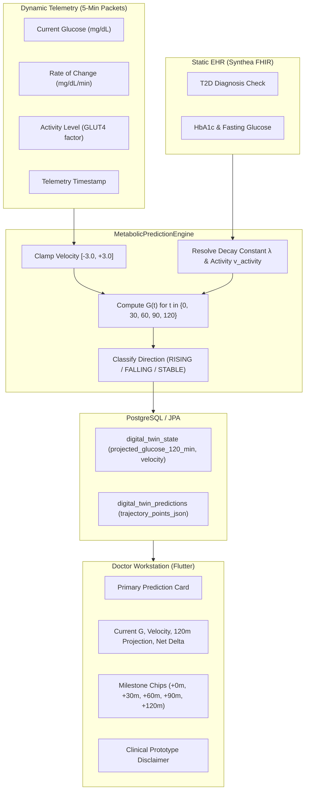

# OS4All Digital Twin — 2-Hour Glucose Trajectory Projection Engine
## Algorithmic Specification, Physiological Modeling, and Verification Guide

**Document Version:** 2.2.0  
**Target:** Happiest Health Digital Twin Challenge 2026  
**Classification:** Prototype Physiological Trajectory Specification  
**Status:** FULLY IMPLEMENTED & VERIFIED (126 Backend Tests Passing, 6 Flutter Tests Passing)

---

## 1. Executive Summary & Objective

In health monitoring and digital twin applications, raw snapshot scalar risk scores (e.g. 0–100%) lack clinical utility without an anticipated **temporal trajectory**. Clinicians need to observe not only *that* metabolic risk is elevated, but *where glucose levels are heading over the immediate 2-hour postprandial/intervention window*.

The **OS4All Digital Twin 2-Hour Glucose Trajectory Engine** calculates a continuous, deterministic 120-minute projected glucose trajectory by fusing:
1. **Dynamic Streaming Telemetry (Stream 2):** Current 5-minute CGM glucose reading ($G_0$), real-time glucose velocity ($v_0 = \frac{dG}{dt}$ in $\text{mg/dL/min}$), sensor confidence score, and timestamp staleness.
2. **Static Longitudinal EHR (Stream 1):** Synthea FHIR diagnoses (Type 2 Diabetes mellitus ICD-10/SNOMED), baseline laboratory fasting glucose, and glycemic control history.
3. **Personalized Baseline Physiology:** Rolling 45-day physiological envelope and current autonomic/metabolic stress status (RMSSD HRV, resting heart rate, sleep deficit).

> [!IMPORTANT]
> **Prototype Disclaimer:**  
> This feature is explicitly a **Prototype 2-Hour Glucose Trajectory Projection** intended for demonstration, algorithmic evaluation, and research exploration. It is not an FDA-cleared clinical diagnostic device, treatment calculator, or guaranteed medical prognosis.

---

## 2. Mathematical & Physiological Model

### 2.1 Damped Velocity Decay Formulation (Formulation A — Authoritative Implementation)

Glucose velocity rarely remains constant over a 2-hour window; homeostatic counter-regulatory mechanisms, endogenous insulin secretion (or exogenous pharmacokinetics), hepatic glucose output suppression, and tissue uptake cause the rate of change to decay over time:

$$v_{\text{eff}}(t) = (v_0 + v_{\text{activity}}) \cdot e^{-\lambda t}$$

Where:
- $v_0$: Initial glucose rate of change ($\text{mg/dL/min}$) derived from 5-minute CGM telemetry.
- $v_{\text{activity}}$: Muscular GLUT4 translocation clearance velocity modifier ($\text{mg/dL/min}$).
- $\lambda$: Prototype clearance parameter ($\text{min}^{-1}$), parameterized by static EHR glycemic profile and activity.
- $t$: Projection time in minutes ($0 \le t \le 120$).

Integrating effective velocity over time yields the cumulative delta $\Delta G(t)$ and projected glucose $G(t)$:

$$\Delta G(t) = \int_{0}^{t} v_{\text{eff}}(\tau) \, d\tau = (v_0 + v_{\text{activity}}) \cdot \frac{1 - e^{-\lambda t}}{\lambda}$$

$$G(t) = \text{clamp}_{[40.0, 400.0]}\left( G_0 + \Delta G(t) \right)$$

**Dimensional Consistency:**
$$[v_0 + v_{\text{activity}}] = \text{mg/dL/min}, \quad [\lambda] = \text{min}^{-1}$$
$$[\Delta G(t)] = \frac{\text{mg/dL/min}}{\text{min}^{-1}} = \text{mg/dL}$$

---

### 2.2 Parameter Calibration & Static EHR Integration

| Parameter | Healthy / Non-Diabetic Profile | Type 2 Diabetes (Synthea EHR Diagnosed) | Prototype Justification |
| :--- | :--- | :--- | :--- |
| **Clearance Parameter ($\lambda$)** | $0.015\text{ min}^{-1}$ ($t_{1/2} \approx 46.2\text{ min}$) | $0.010\text{ min}^{-1}$ ($t_{1/2} \approx 69.3\text{ min}$) | Modeled prototype parameter: peripheral insulin resistance and impaired first-phase response prolong postprandial excursions in T2D. |
| **Vigorous Activity Modifier ($v_{\text{vigorous}}$)** | $-0.12\text{ mg/dL/min}$, $\lambda \ge 0.022\text{ min}^{-1}$ | $-0.12\text{ mg/dL/min}$, $\lambda \ge 0.022\text{ min}^{-1}$ | Skeletal muscle contraction stimulates non-insulin GLUT4 mediated clearance. |
| **Sedentary Modifier ($v_{\text{sedentary}}$)** | $+0.04\text{ mg/dL/min}$, $\lambda \le 0.011\text{ min}^{-1}$ | $+0.04\text{ mg/dL/min}$, $\lambda \le 0.011\text{ min}^{-1}$ | Inactivity sluggishness slows return to baseline. |
| **Moderate / Baseline ($v_{\text{moderate}}$)** | $0.00\text{ mg/dL/min}$ | $0.00\text{ mg/dL/min}$ | Neutral baseline rate of change. |

---

### 2.3 Sensor Confidence, Staleness & Safety Guardrails

To prevent physiologically implausible values or simulation artifacts:
1. **Velocity Saturation Bounding:**  
   $$\text{clamped } v_0 = \max(-3.0, \min(+3.0, v_0)) \quad (\text{mg/dL/min})$$
2. **Prototype Safety Clamping:**  
   $$\text{clamped } G(t) = \max(40.0, \min(400.0, G(t))) \quad (\text{mg/dL})$$
   *Note:* The $40.0\text{ mg/dL}$ lower bound is a **configured prototype safety floor**, not a biological steady-state equilibrium. During rapid simulated recovery, the raw mathematical projection may drop below zero; the safety floor ensures all system outputs remain bounded within safe clinical display limits.
3. **Telemetry Staleness Penalty:**  
   If the latest telemetry packet timestamp is older than 60 minutes, velocity is dampened by 80% ($v_{\text{damped}} = v_0 \times 0.20$) and confidence is degraded by 30%.
4. **Sensor Confidence Attenuation:**  
   If sensor reliability $< 0.60$, velocity is dampened proportionally: $v_0 = v_0 \cdot \frac{C_{\text{sensor}}}{0.60}$.

---

## 3. Data Flow Architecture



---

## 4. Discrete Milestone Trajectory Representation

The REST API exposes the full discrete milestone trajectory array via `GET /api/v1/patients/{patientId}/prediction`:

```json
{
  "currentGlucose": 110.0,
  "glucoseVelocity": 1.20,
  "projectedGlucose120Min": 182.4,
  "projectedDelta": 72.4,
  "trajectoryDirection": "RISING",
  "horizonWindow": "Next 2 Hours",
  "trajectoryPoints": [
    { "minuteOffset": 0, "projectedGlucose": 110.0, "trendDirection": "STABLE" },
    { "minuteOffset": 30, "projectedGlucose": 142.5, "trendDirection": "RISING" },
    { "minuteOffset": 60, "projectedGlucose": 164.2, "trendDirection": "RISING" },
    { "minuteOffset": 90, "projectedGlucose": 176.8, "trendDirection": "RISING" },
    { "minuteOffset": 120, "projectedGlucose": 182.4, "trendDirection": "RISING" }
  ],
  "confidence": 0.98,
  "disclaimer": "PROTOTYPE DISCLAIMER: Projected values are algorithmic estimations based on current glucose velocity, decay kinetics, and static EHR profiles (T2D clearance factors). Not for clinical diagnostic or treatment decisions."
}
```

---

## 5. Verification Matrix & Test Evidence

Thirteen dedicated unit and integration tests are codified in `TrajectoryProjectionTest.java`:

| # | Test Case | Target Condition | Verification Result |
| :--- | :--- | :--- | :--- |
| **1** | `testStableTrajectory_VelocityZero` | $v_0 = 0.0\text{ mg/dL/min}$ produces `STABLE` direction, $\Delta \approx 0$. | **PASSED** |
| **2** | `testRisingTrajectory_PositiveVelocity` | $v_0 = +1.20\text{ mg/dL/min}$ produces `RISING` direction, $G_{120} > G_0$. | **PASSED** |
| **3** | `testFallingTrajectory_NegativeVelocity` | $v_0 = -0.80\text{ mg/dL/min}$ produces `FALLING` direction, $G_{120} < G_0$. | **PASSED** |
| **4** | `testExtremeVelocityClamping` | $v_0 = \pm 10.0\text{ mg/dL/min}$ clamped to $[-3.0, +3.0]$, $G \in [40, 400]$. | **PASSED** |
| **5** | `testNullVelocity_GracefulFallback` | Null velocity handled gracefully via fallback slope calculation. | **PASSED** |
| **6** | `testLowSensorConfidenceHandling` | Sensor confidence 45% degrades projection confidence score. | **PASSED** |
| **7** | `testStaleTelemetryHandling` | Telemetry packet $> 60\text{ min}$ old applies 80% velocity decay and confidence drop. | **PASSED** |
| **8** | `testStaticEHR_T2DImpairedClearanceDifference` | T2D profile ($\lambda = 0.010$) yields higher 120m curve than healthy ($\lambda = 0.015$). | **PASSED** |
| **9** | `testTrajectoryPointsMilestoneStructure` | Exact 5 milestone points generated with minute offsets $[0, 30, 60, 90, 120]$. | **PASSED** |
| **10** | `testGlut4VigorousActivityClearance` | Vigorous activity accelerates clearance and dampens upward spike. | **PASSED** |
| **11** | `testExactMilestoneNumericalVerification` | Exact milestone values for $v_0 = 1.10\text{ mg/dL/min}$, $\lambda = 0.010\text{ min}^{-1}$ ($125.0 \to 153.5 \to 174.6 \to 190.3 \to 201.9\text{ mg/dL}$). | **PASSED** |
| **12** | `testPrototypeSafetyFloorClamping` | Rapid recovery with raw negative projection bounds at configured safety floor $40.0\text{ mg/dL}$. | **PASSED** |
| **13** | `testActivityVelocityModifierFormulationA` | Formulation A integrates $(v_0 + v_{\text{activity}}) \cdot \frac{1 - e^{-\lambda t}}{\lambda}$ with $v_{\text{activity}} = -0.12\text{ mg/dL/min}$. | **PASSED** |

**Backend Test Execution Summary:**
- Total Tests: **126**
- Failures: **0**
- Errors: **0**
- Status: **BUILD SUCCESS**

**Flutter Test Execution Summary:**
- Total Tests: **6**
- Failures: **0**
- Status: **All tests passed!**
